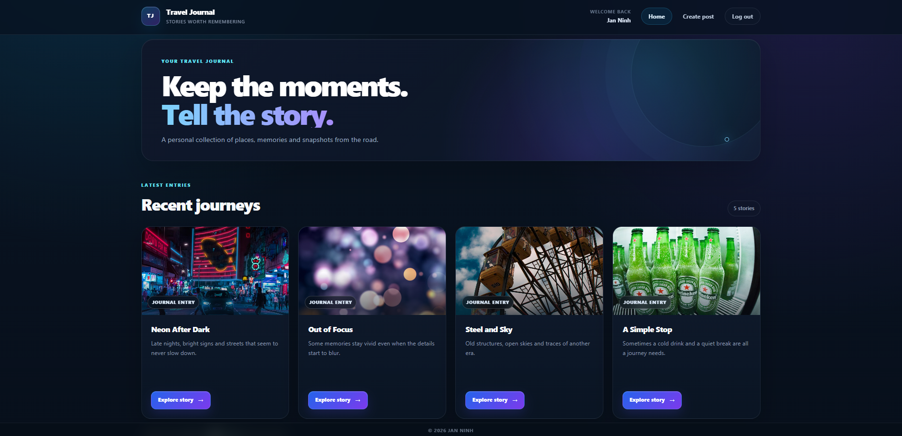
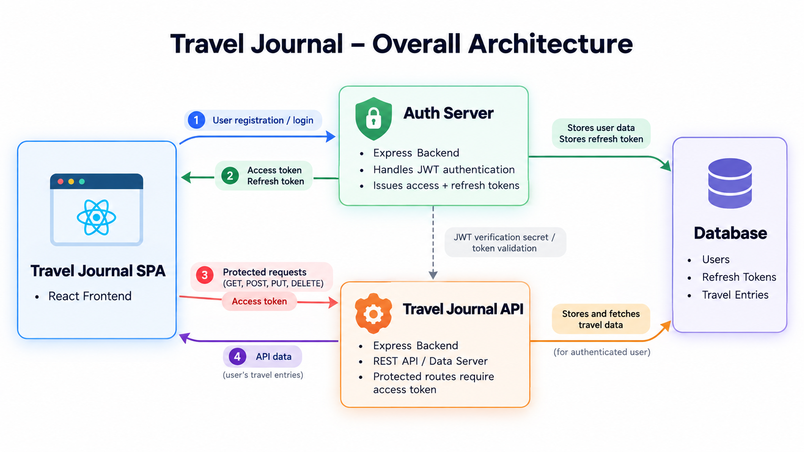

# Travel Journal Full Stack

A three-part full-stack web application built with React, TypeScript, Node.js, Express and MongoDB. It connects a React SPA with a dedicated authentication service and a separate data API, with a focus on authentication, authorization and reliable data flows across service boundaries.



## What this project demonstrates

- React and TypeScript SPA with protected and guest-only routes
- Dedicated Express authentication service and separate Express data API
- JWT access tokens and opaque refresh tokens with database-backed rotation
- httpOnly cookies with automatic access-token refresh and one-time request retry
- Role-based and ownership-based authorization enforced by the API
- MongoDB/Mongoose, Zod validation and full-stack debugging across client, API, auth and database

## Architecture



The client communicates with two backend services. The auth service handles registration, login, logout, session recovery and token refresh. The data API owns journal posts and verifies access tokens for protected operations.

More detailed diagrams: [Auth flow](docs/auth-flow.png) | [Data flow](docs/data-flow.png)

## Tech stack

**Frontend:** React, TypeScript, React Router, Vite, Tailwind CSS, DaisyUI

**Backend:** Node.js, Express, TypeScript, Mongoose, Zod, bcrypt, JWT

**Database:** MongoDB Atlas

**Tooling:** Git, npm, ESLint, Postman

## My contribution

This project was developed during my Full Stack Web and App Development training at WBS Coding School. My work focused on integrating and debugging the authentication and authorization flow across the three applications.

- Login, registration, logout and session recovery
- AuthContext, protected routing and client-side refresh/retry behavior
- Role checks and ownership authorization across frontend and API
- Data flow and debugging across React, Express and MongoDB

I also rebuilt the core authentication flow in a separate learning pass with minimal guidance to verify my understanding of the underlying concepts.

## Run locally

Before starting, copy the provided `.env.example` files to `.env.development.local` in both backend services and to `.env` in the client. Both backend services must use the same `ACCESS_JWT_SECRET` and MongoDB database.

```bash
# Terminal 1
cd auth-service
npm install
npm run dev

# Terminal 2
cd data-api
npm install
npm run dev

# Terminal 3
cd client
npm install
npm run dev
```

Default ports:

- Auth service: `3000`
- Data API: `8000`
- React client: `5173`
